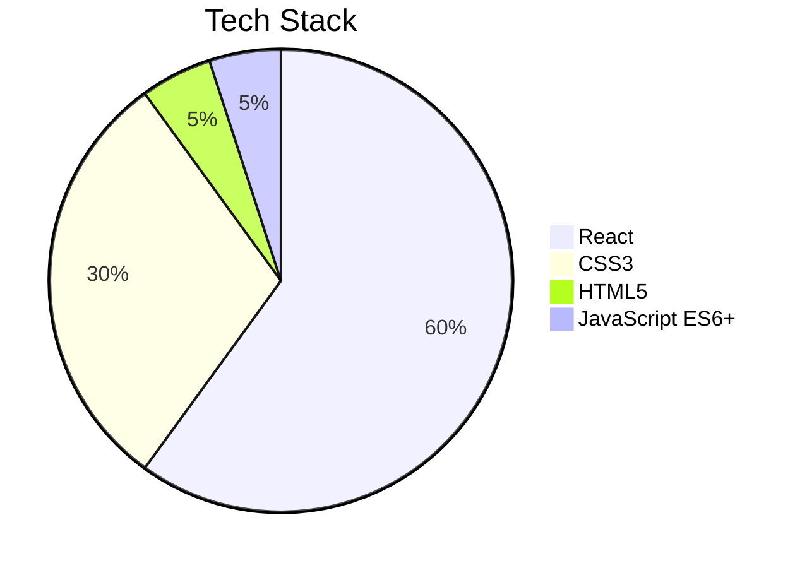

# 🧳 PackRight - Smart Travel Packing List

**PackRight** is a minimalist travel packing list app that helps you stay organized and never forget essentials. Add items, track what’s packed, and even shop on Amazon — all in one smooth, responsive UI.

## 🔗 Live Demo

[👉 View Live Site on Netlify](https://packright.netlify.app)

---

## ✨ Features

### 📝 Item Management

- Add items with custom quantity (1-20)
- Mark items as packed (with strikethrough)
- Delete items with one click
- Toggle between packed and unpacked

### 🛒 Amazon Integration

- "Buy on Amazon" button opens product search in a new tab

### 🔍 Smart Organization

- Sort items by: Input Order / Description / Packed Status
- Clear the list in one click

### 📊 Progress Tracking

- Real-time count of packed vs. unpacked items
- Completion percentage display
- Friendly empty state encouragement

### 🎨 Polished UI

- Alternating item background colors
- Subtle hover transitions
- Fully responsive across devices

---

## 🛠️ Tech Stack

